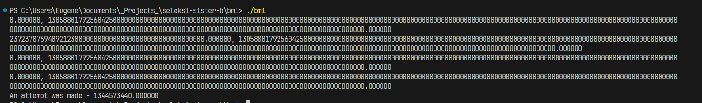

# Belajar Matematika Isekai
## ARM Assembly
Reference: https://developer.arm.com/documentation/dui0068/b/ARM-Instruction-Reference

Instructions used in [belajar-matematika.txt](belajar-matematika.txt)

- add/sub(s) Rd, Rn, Op2: Rd = Rn (add/subtract) Op2; s = set flag
- mov Rd, Op2: move Op2 -> Rd
- mul(s) Rd, Rm, Rs: Rd = Rm multiply Rs
- and/orr/eor(s) Rd, Rn, Operand2: Rd = Rn (and/or/xor) Operand2
- bl(cond) label: copy address of next instruction to r14 and branch to label

- lsl Rd, Rm, Rs: logical shift left
- asr Rd, Rm, Rs: arithmetic shift right
- sdiv Rd, Rn, Rm: signed division; Rd=Rn/Rm
- ret: return
- fadd Fd, Rn, Fm: floating point addition; Fd = Rn + Fm
- fmul Fd, Fn, Fm: floating point multiplication
- fmov d, n : floating point move without conversion

- stp A, B, \[X]: Store pair register; store A to address X, store B to next address (aligned)
- ldp A, B, \[X]: load pair of register; load A from address X, load B from next address (aligned)
- stur A, \[X]: store register A to \[X] (unscale offset)
- ldur A, \[X]: load register A from \[X] (unscale offset)
- fcvtzs : floating point to signed integer (round to zero)
- sshll.2d : signed shift left long
- scvtf: signed fixed point to floating point
- str Ra, \[Rb]: store Ra to address Rb 
- adrp: calculate address of page


## Interpretation
```
<_flag>:
  sub     sp, sp, #48               @ sp = sp - 48
  stp     x29, x30, [sp, #32]       @ store x29, x30 to [sp + 32], save old frame pointer and link register (return)
  add     x29, sp, #32              @ x29 = sp + 32, setup frame pointer
  stur    w0, [x29, #-4]            @ [x29-4] = w0
  stur    w1, [x29, #-8]            @ [x29-8] = w1

    @ local variable [x29-4] = w0, [x29-8] = w1

  ldur    w8, [x29, #-4]            @ w8 = [x29-4]
  asr     w8, w8, #2                @ w8 = w8 >> 2
  stur    w8, [x29, #-4]            @ [x29-4] = w8

    @ local variable [x29-4] = [x29-4] >> 2                        

  ldur    w8, [x29, #-4]            @ w8 = [x29-4]
  add     w8, w8, #40               @ w8 = w8 + 40
  stur    w8, [x29, #-4]            @ [x29-4] = w8
  
    @ local variable [x29-4] = [x29-4] + 40

  ldur    w8, [x29, #-4]            @ w8 = [x29-4]
  subs    w8, w8, #2                @ w8 = w8 - 2; check flag zero/negative result
  stur    w8, [x29, #-4]            @ [x29-4] = w8

    @ local variable [x29-4] = [x29-4] - 2                        

  ldur    w8, [x29, #-4]            @ w8 = [x29-4]
  mov     w9, #10                   @ w9 = 10
  sdiv    w8, w8, w9                @ w8 = w8 / w9; signed division
  stur    w8, [x29, #-4]            @ [x29-4] = w8

    @ local variable [x29-4] = [x29-4] / 10                        

  ldur    w8, [x29, #-8]            @ w8 = [x29-8]
  ldur    w9, [x29, #-4]            @ w9 = [x29-4]
  mul     w8, w8, w9                @ w8 = w8 * w9
  stur    w8, [x29, #-4]            @ [x29-4] = w8

    @ local variable [x29-4] = [x29-8] * [x29-4]

  ldur    w8, [x29, #-8]            @ w8 = [x29-8]
  ldur    w9, [x29, #-4]            @ w9 = [x29-4]
  mul     w8, w8, w9                @ w8 = w8 * w9
  stur    w8, [x29, #-8]            @ [x29-8] = w8

    @ local variable [x29-8] = [x29-8] * [x29-4]

  ldur    w8, [x29, #-8]            @ w8 = [x29-8]
  ldur    w9, [x29, #-4]            @ w9 = [x29-4]
  ldur    w10, [x29, #-8]           @ w10 = [x29-8]
  mul     w9, w9, w10               @ w9 = w9 * w10
  lsl     w8, w8, w9                @ w8 = w8 << w9
  stur    w8, [x29, #-4]            @ [x29-4] = w8

    @ local variable [x29-4] = [x29-8] << ([x29-4] * [x29-8])

  ldur    w8, [x29, #-4]            @ w8 = [x29-4]
  ldur    w9, [x29, #-8]            @ w9 = [x29-8]
  and     w8, w8, w9                @ w8 = w8 & w9
  stur    w8, [x29, #-12]           @ [x29-12] = w8

    @ new local variable [x29-12] = [x29-4] & [x29-8]

  ldur    w8, [x29, #-12]           @ w8 = [x29-12]
  ldur    w9, [x29, #-4]            @ w9 = [x29-4]
  eor     w8, w8, w9                @ w8 = w8 ^ w9
  ldur    w9, [x29, #-8]            @ w9 = [x29-8]
  orr     w8, w8, w9                @ w8 = w8 | w9
  stur    w8, [x29, #-12]           @ [x29-12] = w8

    @ local variable [x29-12] = ([x29-12] ^ [x29-4]) | [x29-8]

  ldur    s1, [x29, #-4]            @ s1 = [x29-4]
  fmov    s0, s1                    @ s0 = s1, float
  sshll.2d        v0, v0, #0        @ signed shift left long v0
  scvtf   d0, d0                    @ d0 = float(d0)    double to float

    @ register s0 = [x29-4]

  ldur    s2, [x29, #-8]            @ s2 = [x29-8]
  fmov    s1, s2                    @ s1 = s2
  sshll.2d        v1, v1, #0        @ signed shift left long v1
  scvtf   d1, d1                    @ d1 = signed(d1)
    
    @ register s1 = [x29-8]

  bl      0x100003f9c <_printf>     @ call _printf
    @ assume print d0, d1, i.e. [x29-4], [x29-8]

  str     d0, [sp, #8]              @ [sp + 8] = d0     save [x29-4]
  ldur    s1, [x29, #-12]           @ s1 = [x29-12]
  fmov    s0, s1                    @ s0 = s1
  sshll.2d        v0, v0, #0        @
  scvtf   d0, d0                    @ d0 = float(d0)

    @ register s0 = [x29-12]

  ldur    s2, [x29, #-12]           @ s2 = [x29-12]
  fmov    s1, s2                    @ s1 = s2, float
  sshll.2d        v1, v1, #0        @  
  scvtf   d1, d1                    @ d1 = float(d1)
    @ register s1 = [x29-12]

  bl      0x100003f9c <_printf>     @ call _printf
    @ assume print d0, d1, i.e. [x29-12] twice

  fmov    d1, d0                    @ d1 = d0           i.e  [x29-12]
  ldr     d0, [sp, #8]              @ d0 = [sp + 8]     i.e. [x29-4]
  fmul    d0, d0, d1                @ d0 = d0 * d1, float    [x29-4] * [x29-12]
  fcvtzs  w0, d0                    @ w0 = signed(d0), round to zero, retval

  ldp     x29, x30, [sp, #32]       @ load old return address and return address
  add     sp, sp, #48               @ readjust stack
  ret                               @ return

<_main>:
  sub     sp, sp, #64
  stp     x29, x30, [sp, #48]
  add     x29, sp, #48              @ setup frame pointer, link register
  mov     w8, #0                    @ w8 = 0
  str     w8, [sp, #20]             @ [sp + 20] = w8
  stur    wzr, [x29, #-4]           @ [x29-4] = wzr
  mov     w0, #42                   @ w0 = 42
  str     w0, [sp, #12]             @ [sp + 12] = w0 = 42
  mov     w1, #69                   @ w1 = 69
  str     w1, [sp, #16]             @ [sp + 16] = w1 = 69

  bl      0x100003e10 <_flag>       @ call _flag(69, 42)

  ldr     w1, [sp, #12]             @ w1 = [sp + 12] = 69
  mov     x8, x0                    @ x8 = x0; get _flag return value
  ldr     w0, [sp, #16]             @ w0 = [sp + 16] = 42
  scvtf   d0, w8                    @ d0 = float(w8)
  stur    d0, [x29, #-16]           @ create local var [x29-16] = d0

  bl      0x100003e10 <_flag>       @ call _flag(42, 69)

  scvtf   d0, w0                    @ do = float(w0), return value of _flag
  str     d0, [sp, #24]             @ [sp + 24] = d0
  ldur    d0, [x29, #-16]           @ d0 = [x29-16], first return value?
  ldr     d1, [sp, #24]             @ d1 = [sp+24], second return value?
  fadd    d0, d0, d1                @ d0 = d0 + d1, first + second
  mov     x8, sp                    @ x8 = sp      
  str     d0, [x8]                  @ [x8] = d0

  adrp    x0, 0x100003000 <_main+0x60>
  add     x0, x0, #4020         
  bl      0x100003fa8 <_printf>     @ call _printf
    @ load and print some string?

  ldr     w0, [sp, #20]             @ adjust stack
  ldp     x29, x30, [sp, #48]
  add     sp, sp, #64
  ret                               @ return
```

TL Note: [x] is dereferencing address (?); Xi = 64 bit general purpose register, Wi = 32 bit half of Xi;
Vi = 128 bit floating point register, Di = 64 bit floating point (double), Si = 32 bit floating point (single)

Based on assumptions, the following is the calculation that is processed in _flag
```
a /= 4
a += 40
a -= 2
a /= 10

a = b * a
b = b * a
a = b << (a * b)

c = a & b
c = (c ^ a) | b

print(a,b)
print(c,c)

return a * c
```
Meanwhile in main
```
b = flag(69,42)
a = flag(42,69)
print(a + b)

```
## C Source Code
An attempt at translating ARM assembly to C source code can be viewed [here](bmi.c)


