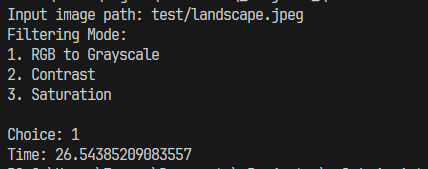
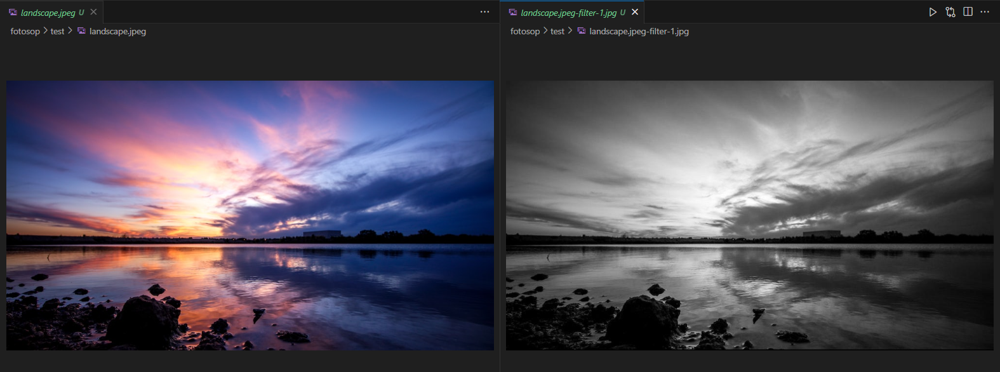

# Fotosop CC 1986
## How to run
1. Install NumPy and PIL
    ```
    pip install numpy
    pip install pillow
    ```
2. Run `fotosop.py`
    ```
    python fotosop.py
    ```
3. Enter a valid image path and choose a filtering mode. For contrast and saturation filters, input the additional arguments required.
4. After selecting a filtering mode, processed image is viewed and saved.

    

    Example comparison
    