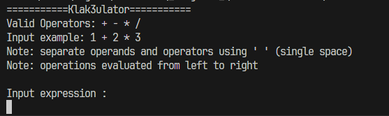
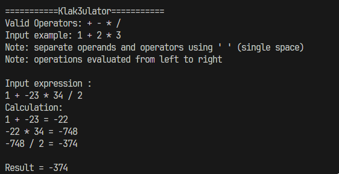

# Klak-Klak-Klakulator
Kalkulator penjumlahan, pengurangan, perkalian, dan pembagian menggunakan operator bitwise.
## Setup
1. Ikuti petunjuk instalasi Zig pada link [ini](https://ziglang.org/learn/getting-started/).
2. Lakukan kompilasi terhadap `klakulator.zig` dengan menjalankan perintah
    ```
    zig build-exe klakulator.zig
    ```
3. Jalankan hasil kompilasi.

## Run
Tampilan dari Klakulator berupa CLI


Cara menggunakannya adalah dengan memasukkan sebuah ekspresi matematika. Format dari ekspresi ini adalah 
```
{angka} [{operator} {angka}]...
```
Angka berada dalam range integer 4 Byte, sedangkan operator adalah '+', '-', '*', atau '/'. Setiap parameter dipisahkan oleh satu karakter spasi (' ').

Contoh masukan valid adalah "1 + -23 * 34 / 2"



Urutan evaluasi adalah dari kiri ke kanan.