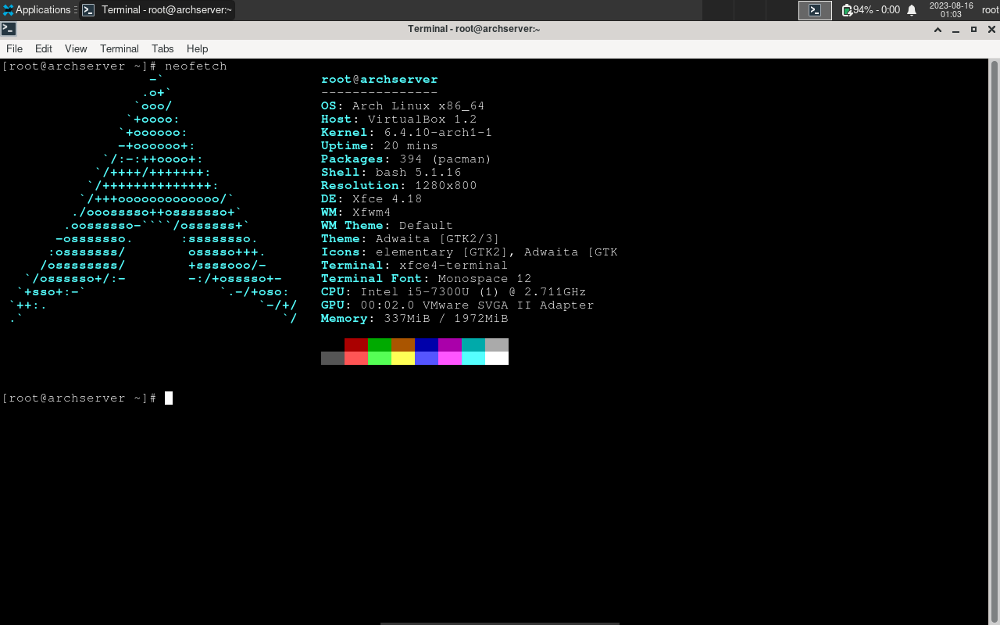

# LinUwUx
## Tools
Softwares used:
- Arch Linux 2023.08.01
- Xfce
- Firefox
- neofetch
- dhcpcd
- VirtualBox

## References
References used:
- [Arch Linux Installation Guide](https://wiki.archlinux.org/title/Installation_guide)

## Results
### Neofetch

### Demo Video
Demo video can be accessed [here](https://youtu.be/YqHhmLN_qHw).