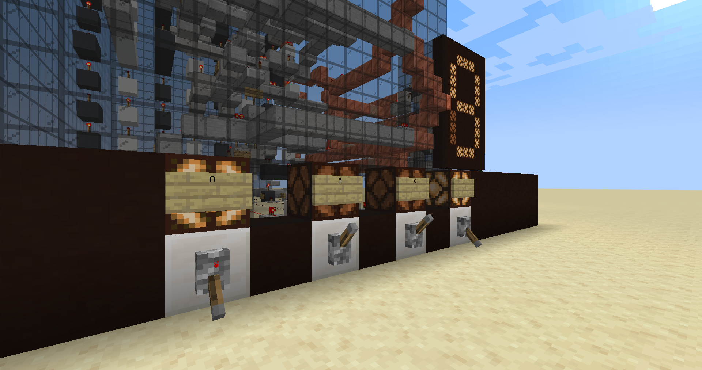

# Minekarnaugh
## 7 Segment Display

7 segment display adalah perangkat layar yang digunakan untuk menampilkan angka desimal (0-9). Jika input adalah empat bit bilangan biner yang merepresentasikan desimal 0-9, dengan setiap bit dinotasikan sebagai A, B, C, D, dan setiap segmen diberikan label a-g (mengikuti penamaan pada gambar di atas), truth table dari 7 segment display adalah sebagai berikut.

| Bilangan desimal | `A` | `B` | `C` | `D` | a | b | c | d | e | f | g |
|------------------|-----|-----|-----|-----|---|---|---|---|---|---|---|
| 0                | `0` | `0` | `0` | `0` | 1 | 1 | 1 | 1 | 1 | 1 | 0 |
| 1                | `0` | `0` | `0` | `1` | 0 | 1 | 1 | 0 | 0 | 0 | 0 |
| 2                | `0` | `0` | `1` | `0` | 1 | 1 | 0 | 1 | 1 | 0 | 1 |
| 3                | `0` | `0` | `1` | `1` | 1 | 1 | 1 | 1 | 0 | 0 | 1 |
| 4                | `0` | `1` | `0` | `0` | 0 | 1 | 1 | 0 | 0 | 1 | 1 |
| 5                | `0` | `1` | `0` | `1` | 1 | 0 | 1 | 1 | 0 | 1 | 1 |
| 6                | `0` | `1` | `1` | `0` | 1 | 0 | 1 | 1 | 1 | 1 | 1 |
| 7                | `0` | `1` | `1` | `1` | 1 | 1 | 1 | 0 | 0 | 0 | 0 |
| 8                | `1` | `0` | `0` | `0` | 1 | 1 | 1 | 1 | 1 | 1 | 1 |
| 9                | `1` | `0` | `0` | `1` | 1 | 1 | 1 | 1 | 0 | 1 | 1 |

Meskipun bilangan biner ABCD dapat menyatakan bilangan desimal hingga 15, bilangan di atas 10 diabaikan karena batasan perangkat 7 segment display. Oleh karena itu, berdasarkan truth table di atas dan pernyataan tersebut, peta Karnaugh dari setiap segmen (a-g) adalah sebagai berikut (tanda X menyatakan tabel kebenaran untuk bilangan 10-15).

Penyederhanaan terhadap fungsi pada peta Karnaugh di atas menghasilkan fungsi-fungsi segmen berikut.

Dan berdasarkan fungsi-fungsi di atas dapat disusun sebuah rangkaian logika

## Minecraft Redstone Logic Gates
Salah satu cara untuk menyimulasikan rangkaian logika di permainan Minecraft adalah dengan menggunakan rangkaian redstone. Berikut adalah contoh gerbang logika AND, OR, dan NOT menggunakan redstone.

## 7 Segment Display using Minecraft Redstone
Berikut adalah hasil pembuatan rangkaian 7 segment display menggunakan redstone.

*World* (Minecraft 1.20.1) yang digunakan tersedia pada file `minekarnaugh.zip`.