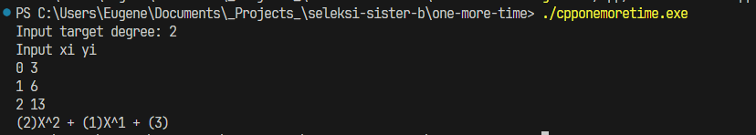
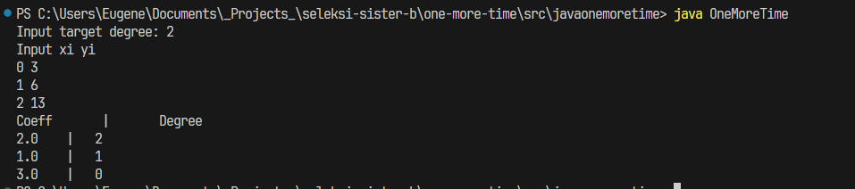
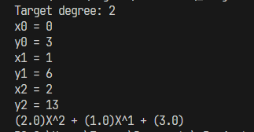
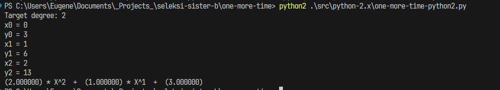

# One More Time
## C++
1. Install GNU Compiler (https://gcc.gnu.org/ or https://www.mingw-w64.org/)
2. Compile
```
g++ src/cpp/one-more-time.cpp -o cpponemoretime
```
3. Execute binary, for example
```
./cpponemoretime.exe
```

## Java
### Install Java

1. Download Java: Go to the official Oracle website (or OpenJDK if you prefer open-source alternatives) to download the Java Development Kit (JDK).

2. Install Java (might need to add to PATH for Windows) and verify installation. Open a terminal and run the following command to verify that Java is installed:
```
java -version
```
### Steps
1. After installing Java, do compile
```
cd src/javaonemoretime
javac OneMoreTime.java
```
2. Run OneMoreTime.class file
```
java OneMoreTime
```



## Python 3
### Steps
1. Install [Python 3](https://www.python.org/downloads/) and add to PATH
2. Run the following command
```
python src/python-3.x/one-more-time.py
```



## Python 2
### Steps
1. Install [Python 2](https://www.python.org/downloads/release/python-272/). If Python 3 is installed in machine as `python`, rename the installed Python 2 binary to `python2`
2. Run the following command
```
python2 .\src\python-2.x\one-more-time-python2.py
```


