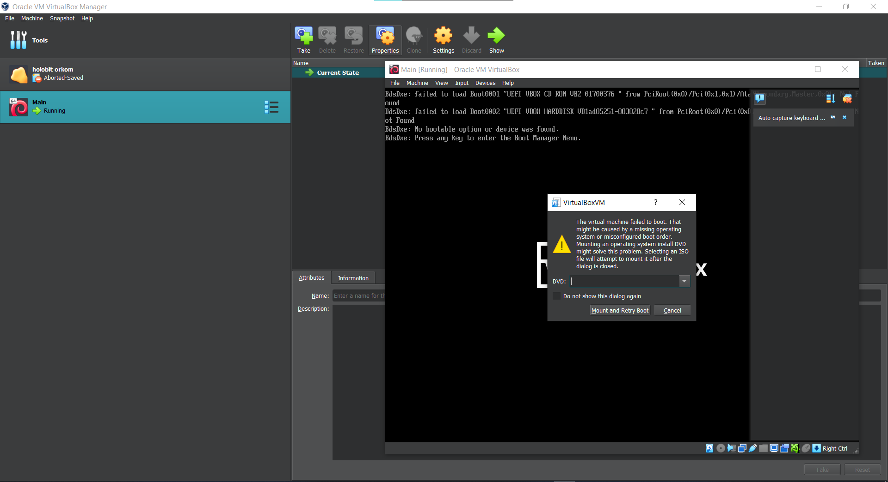
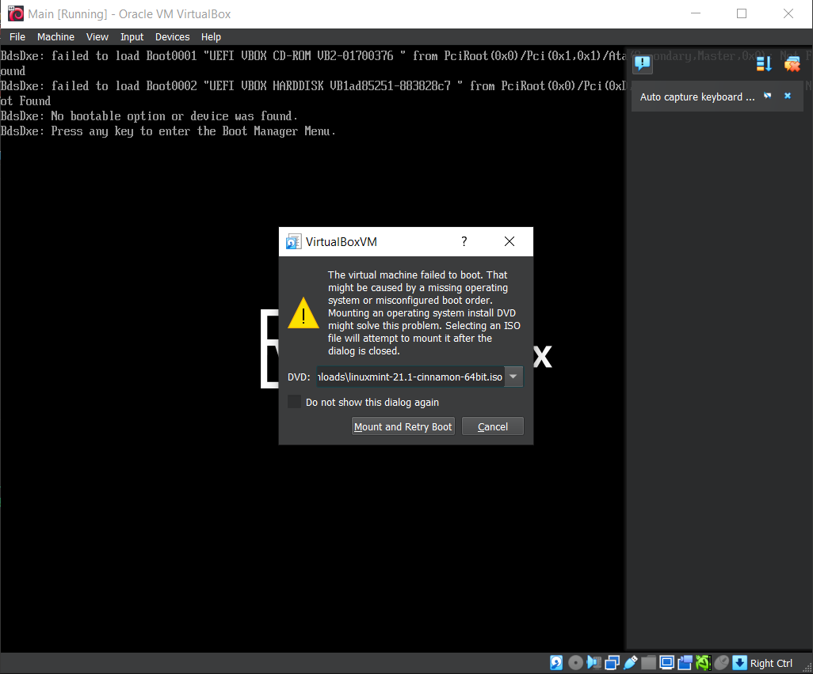
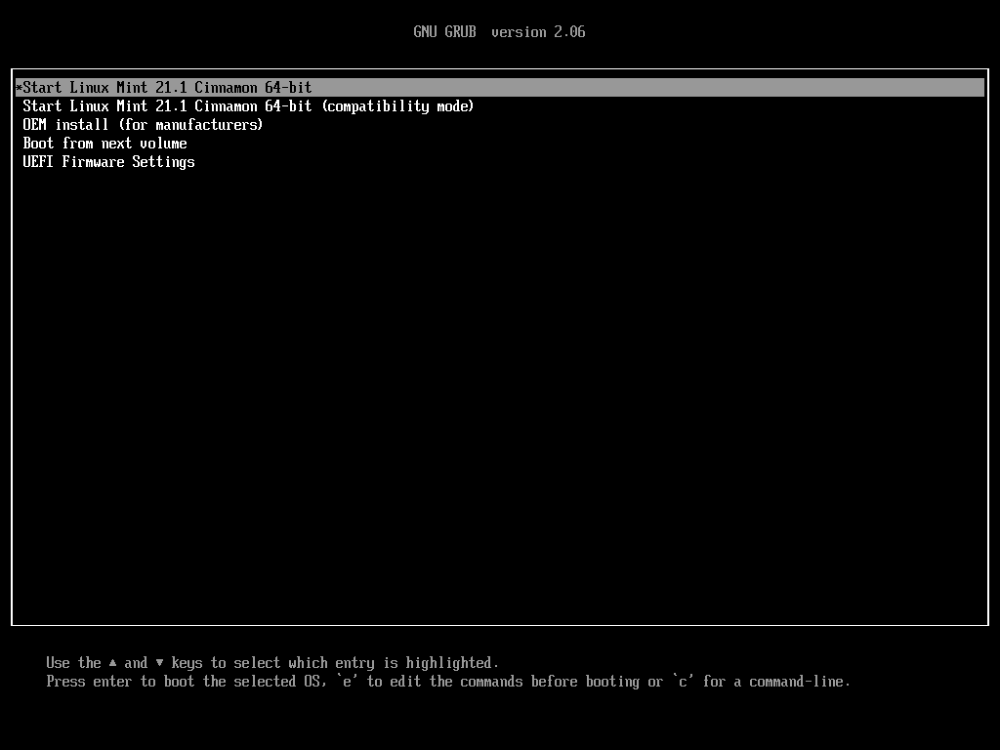
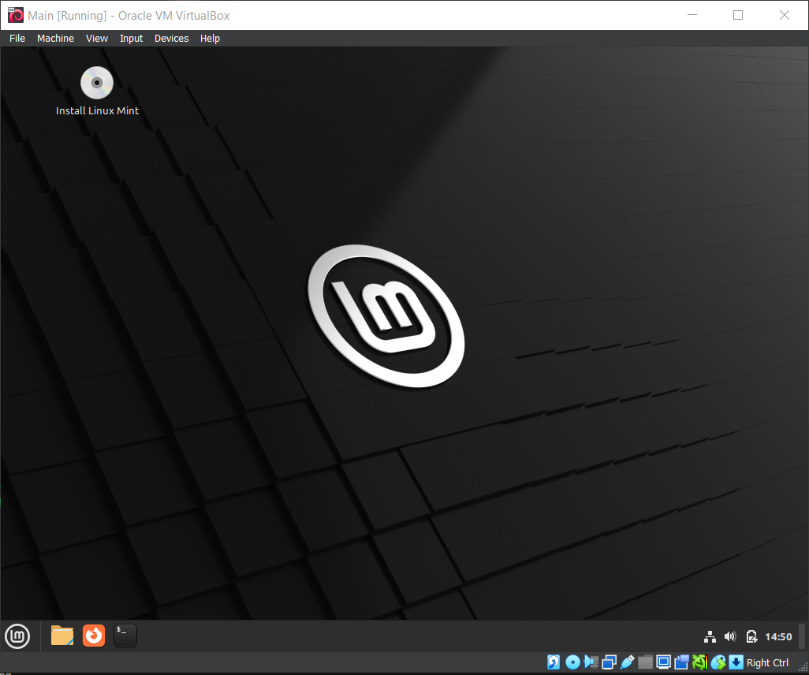
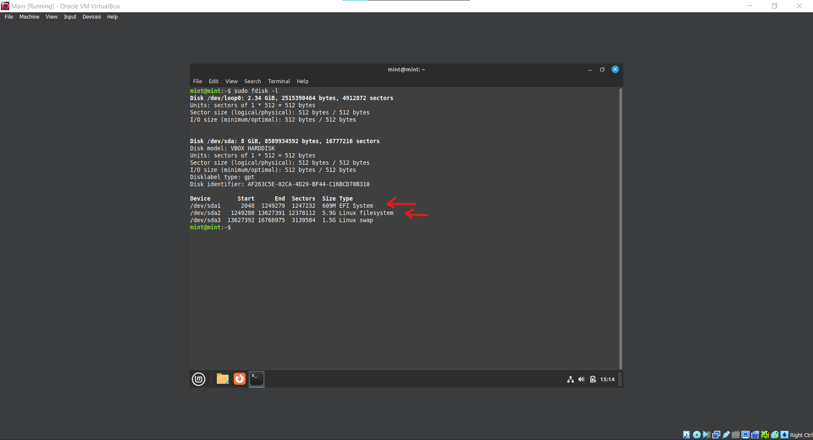
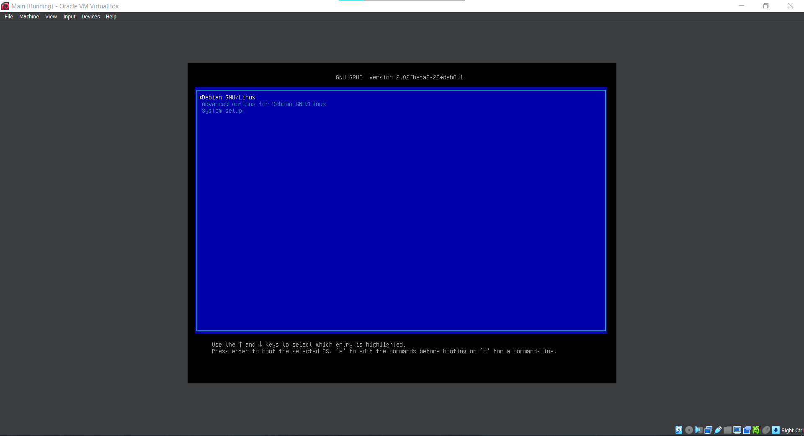
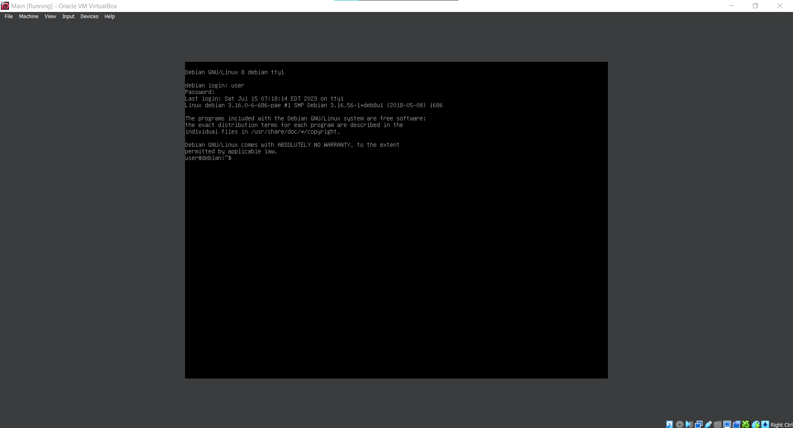

# Restore GRUB

[Click here](https://drive.google.com/drive/folders/1L4i0PVERAtXpwszmvyj35E9QSlBLjM2E?usp=sharing) to download source files.

## How to Restore GRUB
Reference: https://askubuntu.com/questions/88384/how-can-i-repair-grub-how-to-get-ubuntu-back-after-installing-windows

1. Import `main.ova` to virtual machine (e.g. VirtualBox)
2. Try booting into the virtual machine. It should show that the machine failed to boot.


3. Next, try booting using a live CD. The example uses Linux Mint 21.1 ISO




4. Execute the following command to list available partitions. Find the root partition ("Linux filesystem").
    ```sh
    sudo fdisk -l
    ```
    

5. Mount the root partition using command 
    ```sh
    sudo mount /dev/sdXY /mnt
    ```
    In this example, the partition is `/dev/sda2`

6. Mount the EFI partition using command
    ```sh
    sudo mount /dev/sdXX /mnt/boot/efi
    ```
    In this example, the partition is `/dev/sda1`

7. Execute the following command
    ```sh
    for i in /dev /dev/pts /proc /sys /run; do sudo mount -B $i /mnt$i; done
    ```

8. Change the root partition to `/mnt` and do installation and update of GRUB
    ```sh
    sudo chroot /mnt
    ```
    In `chroot`, execute the following
    ```sh
    grub-install /dev/sdX
    update-grub
    ```
    In this example, the device is `/dev/sda`

9. If `grub-install` reports an error that efivars are not found, execute the following and retry `grub-install`
    ```sh
    mount -t efivarfs none /sys/firmware/efi/efivars
    ```

10. Exit chroot (Ctrl+D) and execute the following to reboot
    ```sh
    sudo reboot
    ```

11. GRUB menu is shown upon reboot. Select Debian GNU/Linux and login using the following credentials
    ```
    User: user
    Password: qwertyui
    ```
    
    